# ShopWave - Modern E-Commerce Platform

ShopWave is a feature-rich e-commerce mobile application built with Flutter and Supabase. It offers a seamless shopping experience with a modern UI, robust features, and a responsive design. The platform supports multiple user roles (Customer, Vendor, Admin) with role-specific functionalities.

## 📱 Screenshots

### Customer Experience

<div style="display: flex; flex-wrap: wrap; justify-content: center;">
  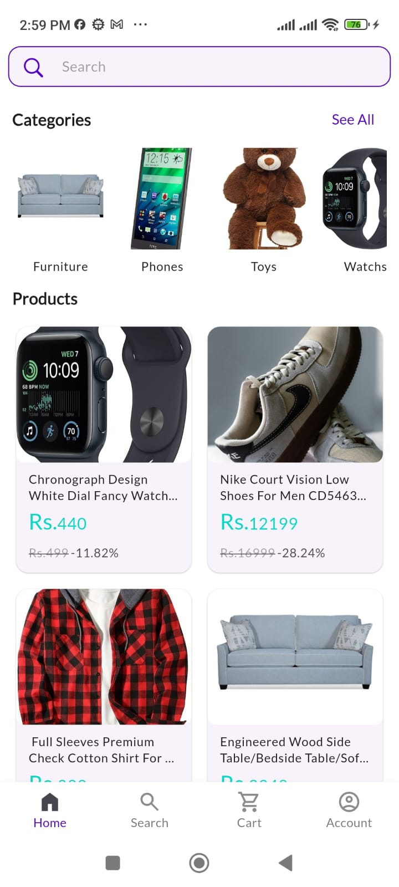
  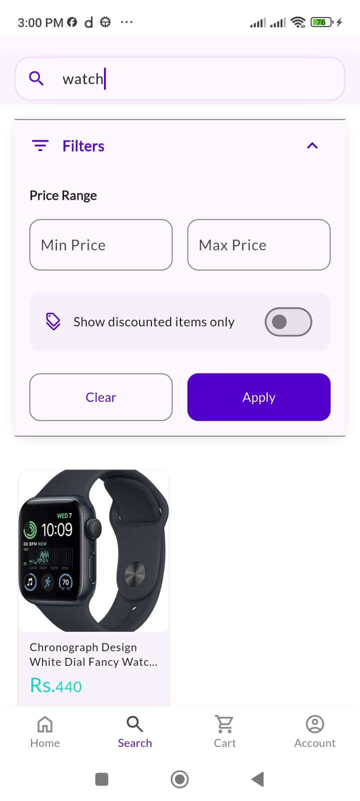
  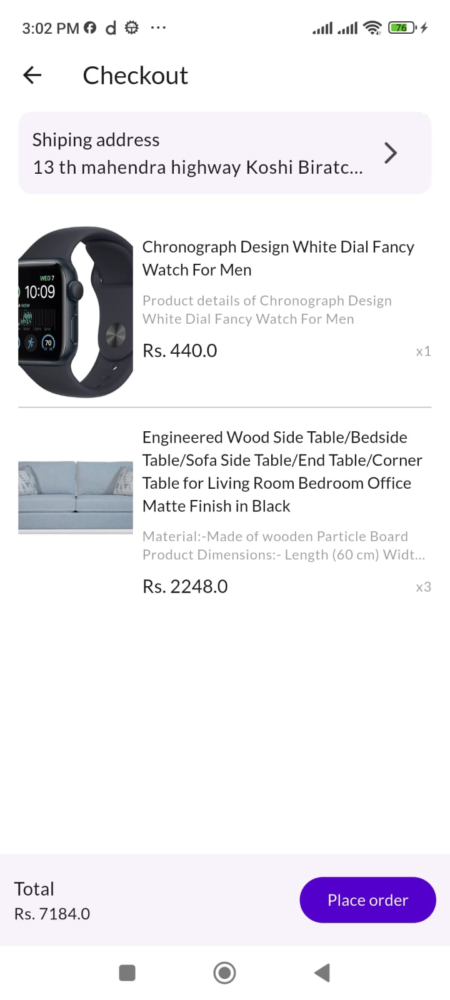
  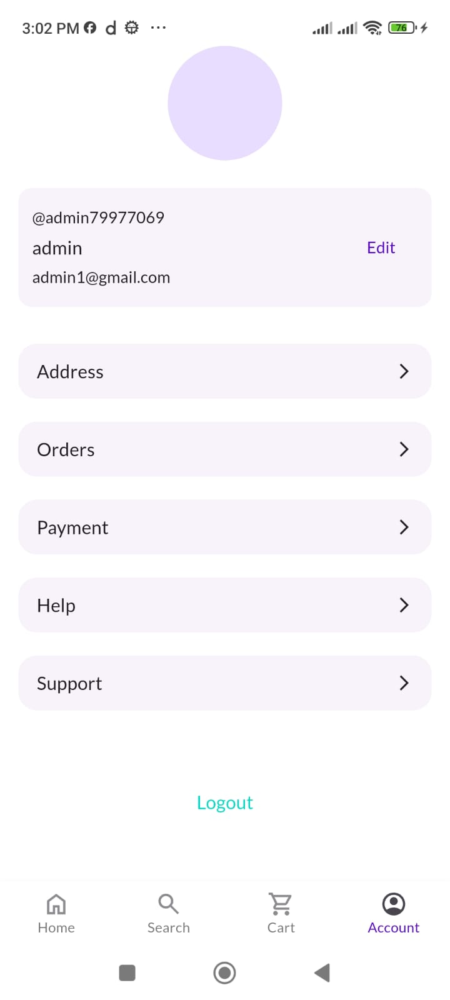
  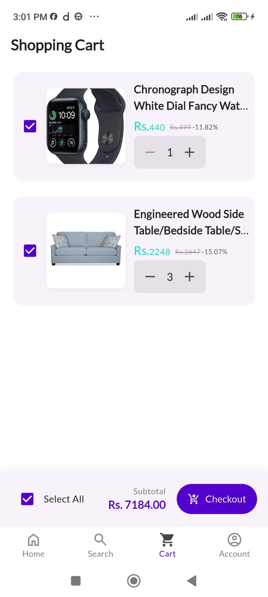
  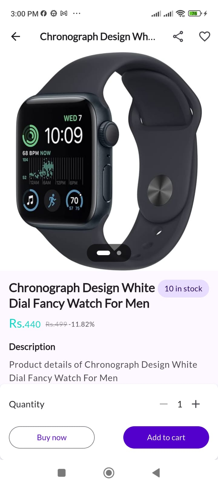
  
  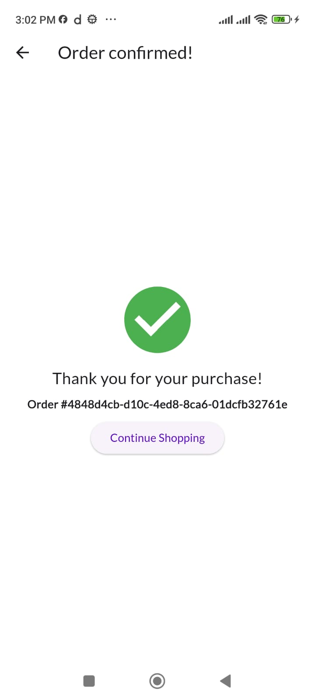

  <!--  -->
  
</div>

### Authentication

<div style="display: flex; flex-wrap: wrap; justify-content: center;">
  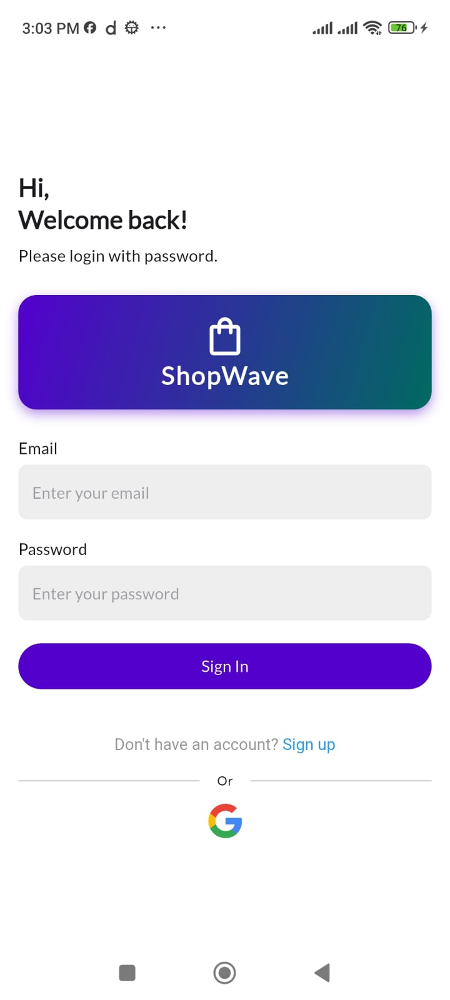
  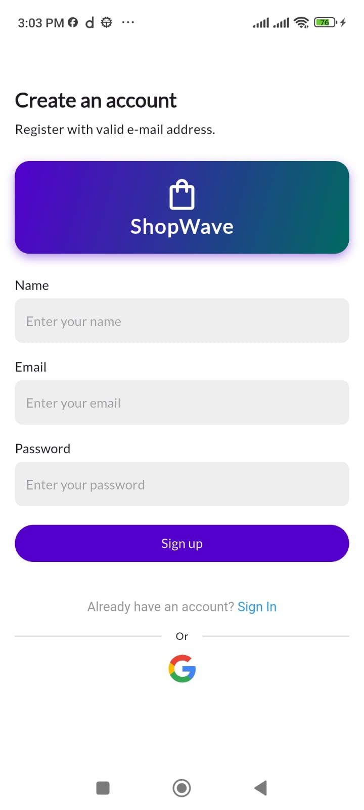
</div>

### Admin Dashboard

<div style="display: flex; flex-wrap: wrap; justify-content: center;">
  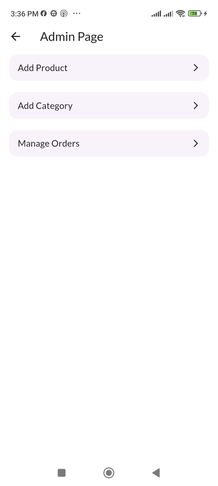
  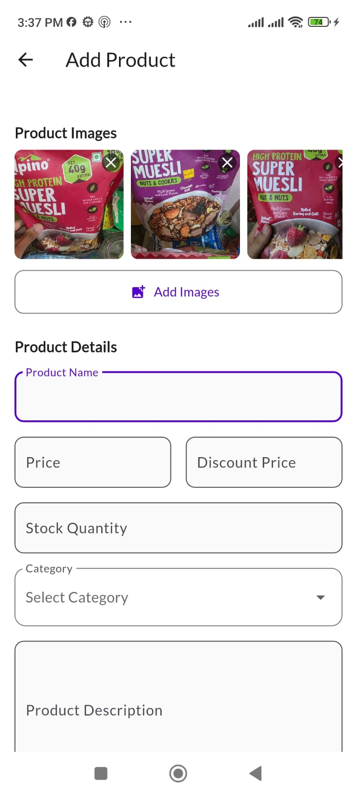
  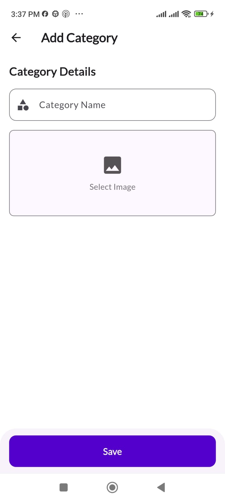
  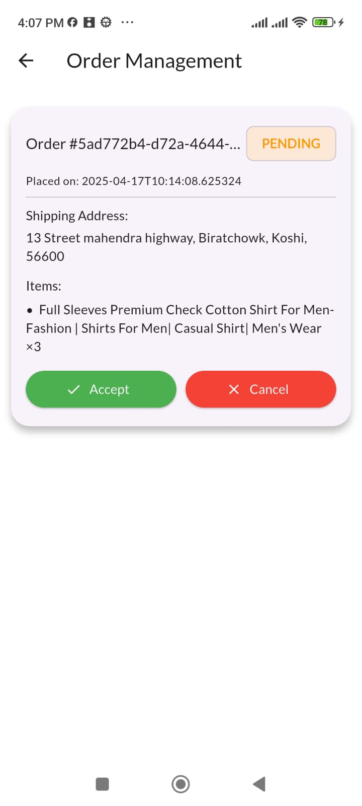
</div>

## ✨ Features

### For Customers
- **User Authentication** - Secure sign-up, sign-in, and profile management
- **Product Browsing** - Browse products by categories with smooth navigation
- **Search Functionality** - Find products quickly with search filters
- **Shopping Cart** - Add, remove, and manage products in your cart
- **Order Management** - Track and manage your orders
- **Address Management** - Save and manage multiple shipping addresses
- **Responsive Design** - Works seamlessly on various device sizes

### For Vendors
- **Product Management** - Add, edit, and remove products
- **Order Fulfillment** - View and manage orders for their products
- **Sales Analytics** - Track sales performance

### For Administrators
- **Complete Platform Management** - Oversee all aspects of the platform
- **User Management** - Manage user accounts and roles
- **Category Management** - Create and manage product categories
- **Order Oversight** - Monitor and manage all orders
- **Content Moderation** - Ensure product listings meet guidelines

## 🛠️ Tech Stack

- **Frontend**: Flutter
- **State Management**: Flutter Bloc
- **Backend**: Supabase
- **Authentication**: Supabase Auth
- **Database**: PostgreSQL (via Supabase)
- **Storage**: Supabase Storage
- **Routing**: Go Router
- **UI Components**: Material Design
- **Animation**: Flutter's built-in animation system

## 🗄️ Database Structure

The application uses Supabase (PostgreSQL) as its database with the following structure:

### User Roles

The system supports three user roles, defined in the `users` table:

- **Customer** - Default role for regular users who can browse products and make purchases
- **Vendor** - Can manage their own products and fulfill orders
- **Admin** - Has full access to manage the platform, including categories, all products, and user management

### Key Tables

- **users** - Stores user information including authentication details and role
- **products** - Contains product information linked to vendors and categories
- **categories** - Stores product categories
- **carts** - Manages shopping cart items for users
- **orders** - Tracks order information including status and payment details
- **order_items** - Contains individual items within an order
- **addresses** - Stores shipping addresses for users
- **product_images** - Contains images associated with products

### Custom Functions

The database includes custom PostgreSQL functions like `get_vendor_orders` that efficiently retrieve order data for vendors, including related product information and shipping details.

## 🚀 Getting Started

### Prerequisites

- Flutter SDK (3.6.2 or higher)
- Dart SDK (3.6.2 or higher)
- Supabase account
- IDE (VS Code, Android Studio, etc.)

### Installation

1. Clone the repository
   ```bash
   git clone https://github.com/sanam-tamang/flutter_ecommerce.git
   cd flutter_ecommerce
   ```

2. Install dependencies
   ```bash
   flutter pub get
   ```

3. Create a `.env` file in the root directory with your Supabase credentials
   ```
   SUPABASE_URL=your_supabase_url
   SUPABASE_ANNONKEY=your_supabase_anon_key
   ```

4. Run the app
   ```bash
   flutter run
   ```

## 📋 Project Structure

```
lib/
├── common/            # Common utilities, widgets, and theme
│   ├── theme/         # App theme configuration
│   ├── utils/         # Utility functions
│   └── widgets/       # Shared widgets
├── core/              # Core functionality and state management
│   ├── app/           # App initialization
│   ├── blocs/         # Global state management
│   ├── failure/       # Error handling
│   ├── repositories/  # Data access layer
│   └── state/         # State management utilities
├── features/          # Feature modules
│   ├── address/       # Address management
│   ├── auth/          # Authentication
│   ├── cart/          # Shopping cart
│   ├── category/      # Product categories
│   ├── home/          # Home page
│   ├── order/         # Order management
│   ├── product/       # Product browsing and details
│   ├── search/        # Search functionality
│   └── user/          # User profile and settings
├── main.dart          # Entry point
└── routes.dart        # App routes
```

Each feature follows a clean architecture pattern with:
- **blocs/** - State management
- **models/** - Data models
- **pages/** - UI screens
- **repositories/** - Data access
- **widgets/** - Feature-specific UI components

## 🤝 Contributing

Contributions are welcome! Please feel free to submit a Pull Request.

1. Fork the repository
2. Create your feature branch (`git checkout -b feature/amazing-feature`)
3. Commit your changes (`git commit -m 'Add some amazing feature'`)
4. Push to the branch (`git push origin feature/amazing-feature`)
5. Open a Pull Request

## 📞 Contact

Sanam Tamang

Project Link: [https://github.com/sanam-tamang/flutter_ecommerce](https://github.com/sanam-tamang/flutter_ecommerce)
